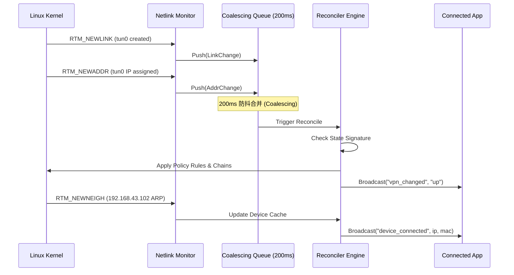

# VPN Share Proxy (vpn-share-proxy) 架构设计与网络思想

## 1. 架构目标与定位

`vpn-share-proxy` 是将 Android 手机作为局域网热点透明代理网关的核心引擎。
它的设计理念是：
- **核心完全独立**：无外置依赖，不依赖任何第三方管理工具或 Shell 运行环境。
- **纯事件驱动**：基于 Linux 内核 Netlink 机制驱动状态机流转。
- **零泄漏、自恢复**：VPN 断开瞬间切断下游转发，防止局域网设备直连暴露私密流量；VPN 重连后毫秒级恢复。
- **C/S 架构**：通过 Unix Domain Socket 向外输出完整的控制面能力与实时事件订阅。

---

## 2. Linux 策略路由核心思想 (Policy Routing Infrastructure)

Android 系统的网络栈基于 Linux Policy Routing (`ip rule`) 与多路由表架构运作。
每个网络接口（如 WiFi、移动数据、每个 VPN 连接）都拥有各自独立的路由表（例如 table `1038`）。

若直接添加默认路由，会破坏手机自身网络连接或导致死循环。因此，`vpn-share-proxy` 建立了一套严密的**优先级槽位隔离架构**：

| 优先级 (Priority) | 规则定义 | 设计目的与物理意义 |
| :--- | :--- | :--- |
| **5000** | `iif lo goto 6000` | **本机回环绕过**：手机本机发出的内部 IPC/Loopback 流量绝不被热点规则拦截。 |
| **5010** | `iif <tun> lookup main suppress_prefixlength 0` | **VPN 回包直连**：从 VPN 隧道流入的下行回包，查询 `main` 表寻找热点局域网直连子网路由（抑制默认路由），精准送达热点设备。 |
| **5020** | `iif <tun> goto 6000` | **防止递归转发**：所有来自 VPN 隧道的其它包，直接跳过 5030+ 规则，防止包在网卡间死循环。 |
| **5028** | `fwmark 0x80000001/0xffffffff goto 6000` | **MAC/设备直连绕过**：通过 iptables 打上特定标记的设备，直接跳往 6000 锚点，走手机原生物理网络出站。 |
| **5030** | `from 10.0.0.0/8 lookup <table>` | **热点私网 A 段引流**：来自热点私网的流量，强制查询 VPN 关联的路由表。 |
| **5040** | `from 172.16.0.0/12 lookup <table>` | **热点私网 B 段引流**。 |
| **5050** | `from 192.168.0.0/16 lookup <table>`| **热点私网 C 段引流**（Android 最常见的热点网段 `192.168.43.0/24`）。 |
| **6000** | `nop` | **跳跃锚点 (Anchor NOP)**：为上述 `goto` 规则提供确定的落脚点，确保规则流转确定性。 |

---

## 3. 防火墙专用链沙箱 (Isolated Custom Chains)

为杜绝传统脚本在 `FORWARD`、`PREROUTING` 主链中插入规则导致的残留、冲突，`vpn-share-proxy` 采用**沙箱专用链**：

```text
PREROUTING (mangle)  --> VSP_PRE (MAC 过滤打标 / Fwmark)
FORWARD (filter)     --> VSP_FWD (放行转发 + PMTU 动态钳制)
PREROUTING (nat)     --> VSP_NAT (DNS 53 端口重定向)
```

1. **动态 PMTU 钳制 (MSS Clamping)**：
   VPN 隧道具有额外的封装头部（WireGuard/OpenVPN/IPsec 等），导致有效 MTU 小于标准的 1500。
   若下游设备尝试发送 1500 字节的大包且设置了 DF（不分片）标记，会导致严重丢包、网页打不开。
   `vpn-share-proxy` 在 `VSP_FWD` 链中注入：
   `-p tcp --tcp-flags SYN,RST SYN -j TCPMSS --clamp-mss-to-pmtu`
   在 TCP 握手阶段自动重写 MSS 为隧道实际允许的最大值，彻底解决热点设备网速慢、握手超时的难题。

2. **零残留原子重置**：
   重置或退出时，仅需执行 `iptables -F VSP_FWD` / `VSP_PRE` / `VSP_NAT`，主链不受任何影响，系统网络瞬间复原。

---

## 4. 内核事件感知机制 (Netlink Event Loop)

传统方案每隔几秒轮询一次或者依赖不稳定的 `inotifyd`。`vpn-share-proxy` 通过 Netlink 套接字实现事件驱动：


